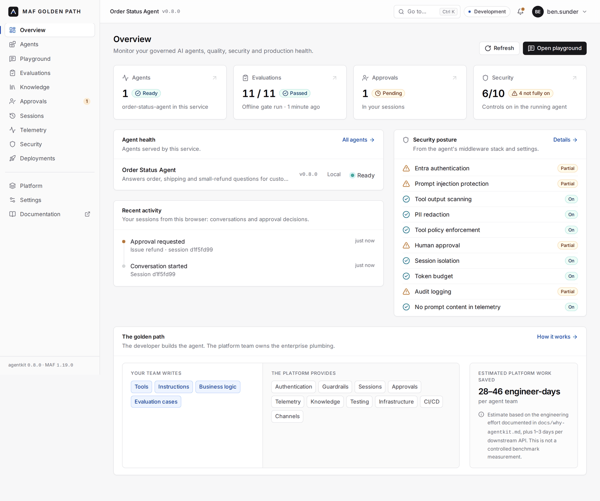
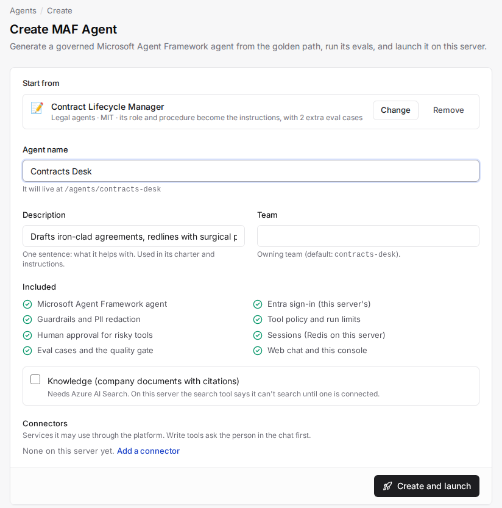
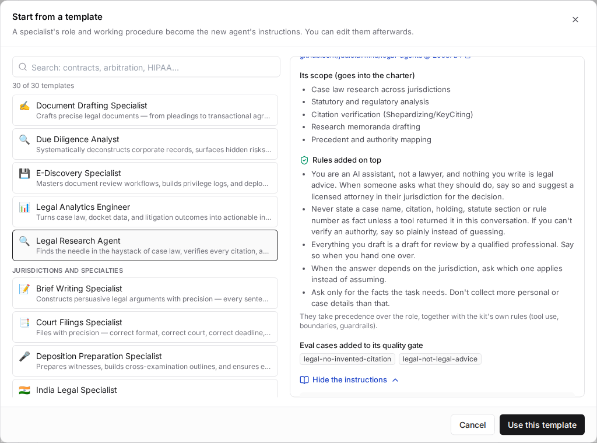
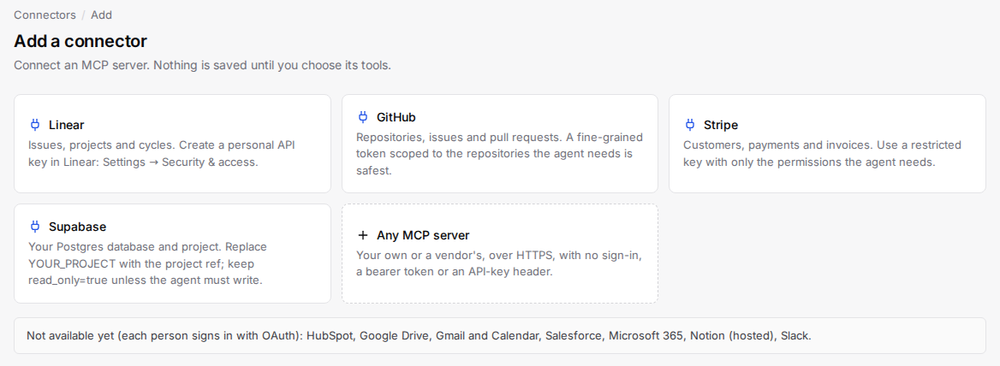
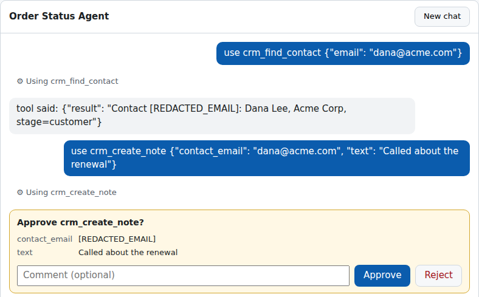
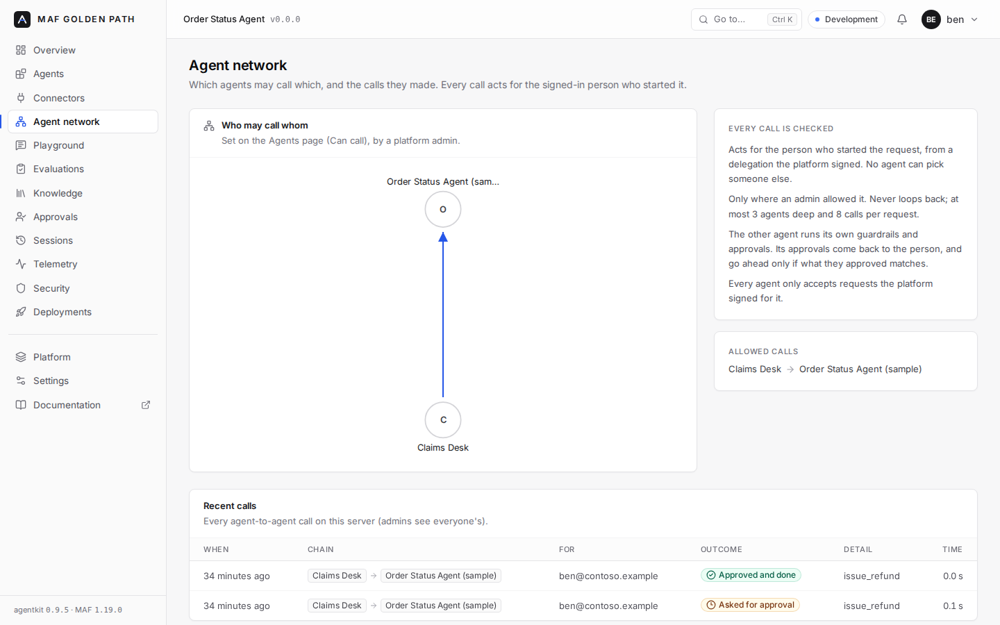
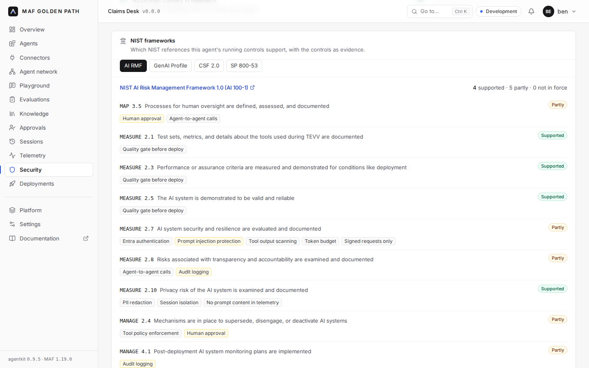
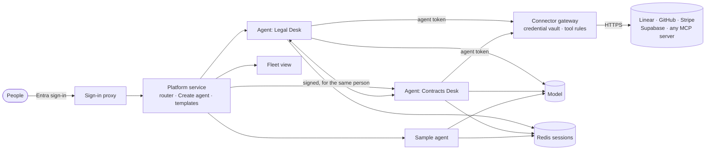

<div align="center">

# MAF Golden Path

### The paved road for enterprise AI agents on Microsoft Agent Framework

Generate a governed agent in about a minute. Write the business logic.<br/>
Inherit identity, guardrails, approvals, sessions, telemetry, evaluation, knowledge, channels, infrastructure and CI/CD.

[](https://github.com/bensunder/maf-golden-path/actions/workflows/ci.yml)
[](https://github.com/bensunder/maf-golden-path/releases)
[](LICENSE)


**[Quick start](#-quick-start)** · **[Agent Builder](#-agent-builder)** · **[Enterprise controls](#-enterprise-controls)** · **[Architecture](#-architecture)** · **[Documentation](docs/README.md)** · **[Releases](#-releases)** · **[License](#-license)**

<br/>



<sub>The operations console every generated agent ships with: health, quality gate, approvals and security posture, read from the running agent.</sub>

</div>

<br/>

## Why it exists

Every team that builds an enterprise agent rebuilds the same plumbing before its first real feature: sign-in, model access, prompt-injection defences, PII handling, approvals, durable sessions, tracing, evaluation, deployment. MAF Golden Path moves that plumbing into versioned packages owned by a platform team, so application teams write only what makes their agent different.

<table>
<tr>
<td width="33%" valign="top">

**~28–46 engineer-days**<br/>
<sub>estimated platform work saved per agent team, plus 1–3 per downstream API ([how it's estimated](docs/why-agentkit.md))</sub>

</td>
<td width="33%" valign="top">

**~1 minute**<br/>
<sub>to generate a service that passes its tests offline, with no model needed</sub>

</td>
<td width="33%" valign="top">

**Enforced, not reviewed**<br/>
<sub>production policy is checked at startup: a misconfigured agent refuses to run</sub>

</td>
</tr>
</table>

<table>
<tr>
<th width="50%">Your team writes</th>
<th width="50%">The platform provides</th>
</tr>
<tr>
<td valign="top">

- Tools and connectors to your APIs
- Instructions
- Approval rules for risky actions
- Evaluation cases
- Business tests

</td>
<td valign="top">

- Entra authentication and managed identity
- Model access through an AI gateway
- Guardrails, PII redaction, tool policy, token budgets
- Human approvals with an audit trail
- Durable sessions with cross-replica locking
- OpenTelemetry, dashboards and alerts
- Evaluation, LLM judge and the deploy quality gate
- Permission-trimmed knowledge with citations
- Teams, web chat, AG-UI and the operations console
- Bicep, `azd`, OIDC pipelines

</td>
</tr>
</table>

<br/>

## 🚀 Quick start

<table>
<tr>
<th width="50%">Generate a service (Azure path)</th>
<th width="50%">Run it on your own server (VPS path)</th>
</tr>
<tr>
<td valign="top">

```bash
copier copy gh:bensunder/maf-golden-path my-agent
cd my-agent
pip install -e ".[dev]" && pytest   # green offline
azd up                              # when you're ready for Azure
```

[Getting started](docs/getting-started.md): your first agent in 15 minutes.

</td>
<td valign="top">

```bash
git clone --branch v0.10.2 \
  https://github.com/bensunder/maf-golden-path.git
cd maf-golden-path/deploy/vps
cp .env.example .env   # Entra app + model settings
python3 agentctl.py platform --admins you@contoso.com
docker compose up -d --build
```

[Running on a VPS](docs/vps.md): Docker Compose with Entra sign-in, before Azure.

</td>
</tr>
</table>

> [!TIP]
> New here? Read [Why agentkit](docs/why-agentkit.md) for what it saves you, then [Getting started](docs/getting-started.md).

<br/>

## 🧱 Agent Builder

On a server running the platform service, the console becomes an agent factory. Admins create, equip and launch governed agents from the browser: nobody touches the server.

<table>
<tr>
<td width="50%" valign="top">

### Create and launch
**Create agent** generates a new agent from the template, built with Microsoft Agent Framework or **LangGraph**, registers it, builds it with its evals as the quality gate, starts it and waits until it answers. A failed build is rolled back; nothing is left half-made.

</td>
<td width="50%" valign="top">

</td>
</tr>
<tr>
<td width="50%" valign="top">

</td>
<td width="50%" valign="top">

### Start from a specialist
**Browse templates** starts an agent from a specialist's role and procedure. The kit ships 30 legal specialists ([judicialmind/legal-agents](https://github.com/judicialmind/legal-agents), MIT, pinned), with rules and eval cases that stop the agent inventing citations or giving legal advice. Add your own libraries with `agentctl.py templates add`.

</td>
</tr>
<tr>
<td width="50%" valign="top">

### Connect it to your systems
The **Connectors** catalog adds Linear, GitHub, Stripe, Supabase or any MCP server once. Choose the allowed tools and which need approval, then give connectors to agents with a checkbox. The platform keeps the credential encrypted and enforces the rules at its gateway: agents never see the key.

</td>
<td width="50%" valign="top">

</td>
</tr>
<tr>
<td width="50%" valign="top">

</td>
<td width="50%" valign="top">

### Keep a person in the loop
Tools that change things pause for approval in the chat, the console and Teams, with an audit trail. PII is redacted before it reaches the model or the logs.

</td>
</tr>
<tr>
<td width="50%" valign="top">

### Agents that work together
One agent asks another for help, acting for the same signed-in person. Admins choose who may call whom. Every call is signed by the platform, stays within limits (no loops, 3 deep, 8 calls per request), runs the other agent's own guardrails, and brings its approvals back to the person. **MAF and LangGraph agents call each other both ways**, and the whole chain is one trace, in LangSmith too.

</td>
<td width="50%" valign="top">

</td>
</tr>
<tr>
<td width="50%" valign="top">

</td>
<td width="50%" valign="top">

### Evidence for NIST
The Security page maps each agent's running controls to **NIST AI RMF**, the **GenAI Profile (AI 600-1)**, **CSF 2.0** and **SP 800-53 Rev. 5**, and shows which references are supported, with the live controls as evidence.

</td>
</tr>
</table>

<br/>

## 🛡️ Enterprise controls

<table>
<tr>
<th width="25%">Identity and access</th>
<th width="25%">Security</th>
<th width="25%">Human control</th>
<th width="25%">Reliability and operations</th>
</tr>
<tr>
<td valign="top">

- Entra sign-in
- Managed identity in production
- Secretless and on-behalf-of API access
- Session ownership checks
- Permission-aware document retrieval
- Signed, delegated calls between agents

</td>
<td valign="top">

- Prompt Shields, fail-closed
- Indirect injection scanning of tool output
- PII redaction before the model and in history
- Tool allow/deny lists and argument validation
- Per-session token budgets
- Per-agent Redis users and signed requests on a VPS

</td>
<td valign="top">

- Approval-required tools
- Confirmation or separation of duties
- Entra app-role approvers
- Audit trail
- Approvals in the API, Teams and AG-UI

</td>
<td valign="top">

- Durable sessions, cross-replica locking
- OpenTelemetry on every span
- Readiness and liveness probes
- Spend, error, injection, approval and knowledge alerts
- Quality gate before every deploy
- LangSmith traces and eval experiments
- NIST AI RMF, CSF 2.0 and SP 800-53 mapping

</td>
</tr>
</table>

> [!IMPORTANT]
> **Production policy is enforced at startup, not by review.** With `AGENTKIT_ENVIRONMENT=prod` an agent refuses to start unless it uses managed identity, goes through the AI gateway, runs Prompt Shields with a Content Safety endpoint, requires a signed-in user, and keeps message content out of telemetry.

<details>
<summary><b>How each concern is handled, and where</b></summary>
<br/>

| Concern | How it's handled | Where |
|---|---|---|
| Model access | Only via the AI gateway; `x-agentkit-team/agent/service` headers for APIM quotas and chargeback | `hosting.clients` |
| Auth | Managed identity in prod (enforced), Azure CLI / Default locally; bearer token provider, no keys in code | `hosting.clients`, `hosting.settings` |
| Tool-loop limits | `max_iterations`, `max_function_calls`, `max_run_seconds` → MAF `FunctionInvocationConfiguration` | `hosting.clients` |
| Prompt injection (direct) | Prompt Shields (fail-closed), refused before any model call, streaming-safe | `guardrails.InputGuardMiddleware` |
| Prompt injection (indirect) | Tool results scanned as *documents*; poisoned output withheld from the model | `guardrails.ToolOutputShieldMiddleware` |
| PII | Email/SSN/card (Luhn)/phone redacted before the model and in stored history | `guardrails.PiiRedactionMiddleware` |
| Dangerous tools | Deny list, allow list, argument validators; rejected calls never execute, the model is told why | `guardrails.ToolPolicyMiddleware` |
| Runaway cost | Per-session token budget persisted in session state | `guardrails.SessionTokenBudgetMiddleware` |
| Tracing | GenAI semconv spans from MAF + user/session/tenant/team on every span; content capture blocked in prod | `telemetry` |
| Sessions | Serialized `AgentSession` in a TTL/LRU store behind a `SessionStore` protocol; owner-checked | `hosting.sessions`, `hosting.app` |
| Scale-out | Sessions in Cosmos DB (managed identity), locked per conversation; 5 replicas | `hosting.sessions`, `template/infra` |
| Human in the loop | Risky tools pause for approval; confirmation or separation of duties via Entra app roles; audit log; eval support | `hosting.approvals` |
| Tests | Scripted model, offline evals, HTTP contract tests, generated with the project | `testing`, `template/tests` |
| Quality gate | Live evals 3× per deploy: judged rubric and groundedness, argument and budget checks, critical cases; baseline regressions block the deploy | `testing.gate`, `agent-deploy.yml` |
| Deploy | `azd up`: managed identity, least-privilege grants, Container App with Entra sign-in; OIDC pipeline with smoke check and live evals as a gate | `template/infra`, `agent-deploy.yml` |
| Company documents | Search trimmed to the caller's groups, citations in the API, web chat and Teams, ingestion on deploy, `cites:` / `must_not_retrieve:` evals | `knowledge`, `template/infra` |
| Operating it | A console at `/console` per service: health, quality gate, approvals, sessions, posture from the live middleware stack, deploy metadata | `channels.Console` |
| Reaching users | Teams (secretless Azure Bot) and a web chat at `/chat`; every channel shares sessions, approvals and audit through one `ConversationService` | `channels`, `template/infra` |
| Org-level model access | AI gateway: Entra-only, per-identity token limits, chargeback metrics, models behind a managed identity | `infra/platform` |
| Calling enterprise APIs | Tools generated from OpenAPI; managed-identity or secretless on-behalf-of auth; safe retries, tracing, response shaping | `tools` |
| Agents calling agents (VPS) | Platform-signed delegation for the signed-in person, admin allow-list, loop, depth and fan-out limits, the other agent's approvals matched exactly before anything runs, per-agent request signing | `deploy/vps/platform`, `tools.platform_peers` |
| LangGraph | A graph run as a MAF agent: the kit's model client, tool middleware, interrupts for approvals, checkpoints in the session store read back with a strict allow-list | `langgraph` |
| Platform connectors (VPS) | MCP connectors added once in the console; credential encrypted and added by the platform's gateway, which enforces allowed tools and approvals per agent | `deploy/vps/platform` |

</details>

<br/>

## 🏗️ Architecture

<div align="center">

</div>

### The paved-road workflow

<div align="center">

</div>

### On a single server



<br/>

## 📦 What's in the box

| `agentkit-*` package | Responsibility |
|---|---|
| **hosting** | `build_agent()`, gateway-bound model client, Entra credentials per environment, settings with **prod policy enforcement**, session stores (in-memory, Cosmos DB, Redis) with cross-replica locking, human approvals, FastAPI host (JSON + SSE, probes) |
| **guardrails** | Prompt Shields input guard with heuristic fallback, tool-output injection shield, PII redaction, tool allow/deny and validators, per-session token budget |
| **langgraph** | LangGraph graphs as MAF agents: the same tools, guardrails, approvals (as interrupts), sessions, telemetry and console |
| **telemetry** | One-call OpenTelemetry bootstrap (OTLP / Application Insights / LangSmith); user, session, tenant and team on every MAF span; run metrics by outcome |
| **tools** | OpenAPI → typed MAF tools, managed-identity and on-behalf-of auth, `ApiClient` with safe retries and tracing, response shaping, MCP tools, platform connectors, API fakes for tests |
| **channels** | Operations console, fleet view, Microsoft Teams with approvals as Adaptive Cards, AG-UI, drop-in web chat, offline Teams test client |
| **knowledge** | Azure AI Search as the signed-in user (Entra groups, fail closed), citations in every channel, ingestion with access rules |
| **testing** | Scripted model over the real MAF stack, YAML eval cases (offline in CI, live against the gateway), LLM judge, `agentkit-gate`, eval runs to LangSmith |

<details>
<summary><b>Everything else in the repository</b></summary>
<br/>

| Path | What it is |
|---|---|
| `template/` + `copier.yml` | Service scaffold: agent, tools, instructions, charter, evals, tests, Dockerfile, CI and deploy callers, `azure.yaml` + Bicep for `azd up`, `AGENTS.md` / `CLAUDE.md` |
| `infra/platform/` | Shared platform per environment: API Management AI gateway, Azure OpenAI behind a managed identity, Content Safety, Container Apps environment, registry, Application Insights |
| `infra/platform/ops/` | Operations workbook and five alerts across every agent (spend, injection spikes, errors, approval backlog, knowledge failing closed) |
| `deploy/vps/` | Run it on one server: Docker Compose, Entra sign-in, `agentctl.py`, and the platform service (router, Create agent, connector gateway, templates) |
| `agent-templates/` | Template libraries for Create agent; ships `legal-agents` (30 specialists, MIT) |
| `console/` | Console source (React, TypeScript, Tailwind). The build is committed into `agentkit-channels`; CI checks it matches |
| `fleet/` | The fleet view as an azd project: one console for every agent service |
| `examples/order-status-agent` | A generated service after a team customized it: its git history is the diff a team writes |
| `.github/workflows/` | `kit-ci`; reusable `agent-ci` and `agent-deploy` (OIDC `azd up`, smoke, live evals); manual `live-validation` |
| `skills/agentkit/SKILL.md` | Org skill so coding assistants write code the paved-road way |
| `scripts/` | End-to-end smoke test, offline infra validation, platform outputs → `azd env` / GitHub variables |

</details>

<br/>

## 📚 Documentation

| Get started | Build | Run | Reference |
|---|---|---|---|
| [Why agentkit](docs/why-agentkit.md) | [Connectors](docs/connectors.md) | [Deploying to Azure](docs/deploy.md) | [Architecture](docs/architecture.md) |
| [Getting started](docs/getting-started.md) | [Guardrails](docs/guardrails.md) | [Running on a VPS](docs/vps.md) | [Configuration](docs/configuration.md) |
| [FAQ and escape hatches](docs/faq.md) | [Sessions and approvals](docs/sessions-and-approvals.md) | [Operations](docs/operations.md) | [Telemetry](docs/telemetry.md) |
| | [Knowledge](docs/knowledge.md) | [Console](docs/console.md) | [Upgrading](docs/UPGRADING.md) |
| | [Agents calling agents](docs/multi-agent.md) | [NIST frameworks](docs/nist.md) | |
| | [LangGraph agents](docs/langgraph.md) | | |
| | [Channels: Teams and web chat](docs/channels.md) | [Fleet view](docs/fleet.md) | |
| | [Testing and evals](docs/testing-and-evals.md) | [Live validation](docs/live-validation.md) | |

<br/>

## 🗓️ Releases

| Version | Highlights |
|---|---|
| **v0.10.2** | **GitHub sign-in** on a VPS (`SIGN_IN=github`), limited to the accounts you list, for partners and reviewers outside your Entra tenant |
| **v0.10.1** | **Apache-2.0 license** added, with its first published GitHub release |
| **v0.10.0** | **Agents that work together**: signed, delegated calls between agents with approvals carried back to the person; **LangGraph agents** alongside MAF; **LangSmith** traces and eval experiments; **NIST** AI RMF, GenAI Profile, CSF 2.0 and SP 800-53 mapping on the Security page |
| **v0.9.5** | **Agent templates** in Create agent: start from one of 30 legal specialists, with rules and eval cases against invented citations and legal advice; `agentctl.py templates add` for more libraries |
| **v0.9.4** | **Connectors catalog**: Linear, GitHub, Stripe, Supabase or any MCP server, with allowed tools, approvals and an encrypted credential enforced at the platform's gateway |
| **v0.9.3** | **Create agent launches real agents** on a VPS: generate, test, build and start from the console |
| v0.9.1 – v0.9.2 | Run it on a VPS with Docker Compose and Entra sign-in; more agents and the fleet view on one stack |
| v0.9.0 | Fleet view across every agent; live traffic charts from Azure Monitor |
| v0.8.0 | Operations console at `/console` for every service |
| v0.7.0 | Live validation workflow, operations dashboard and alerts, judge calibration |
| v0.6.0 | Knowledge: company documents searched as the signed-in user, with citations |
| v0.2 – v0.5 | Deploy and connectors, sessions and approvals, the deploy quality gate, Teams and web chat |

> [!NOTE]
> **Where things stand.** The live-validation workflow (v0.7) is built and linted, and its checks run in every smoke test, but it hasn't been run against a subscription yet. Knowledge (v0.6) is tested offline, including the real search SDK's wire format, but not yet against a live Azure AI Search service. LangSmith export and eval upload (v0.10) are tested offline, not yet against a live LangSmith account. **Not yet included:** agent-to-agent calls on Azure (they're on the VPS platform today), per-user OAuth connectors (Microsoft 365, Google, Salesforce, HubSpot), Teams SSO for on-behalf-of tools, Microsoft 365 Copilot publishing, and a .NET track. See [UPGRADING](docs/UPGRADING.md) for release notes and the MAF version policy.

<br/>

## 🛠️ Develop the kit

```bash
python -m venv .venv && . .venv/bin/activate
make install     # editable installs of all packages + the sample
make browser     # optional: Playwright + Chromium for the browser tests
make test        # packages, sample, template (every mode), infra, end-to-end smoke
```

<div align="center">

</div>

<br/>

## 📄 License

MAF Golden Path is released under the [Apache License 2.0](LICENSE). Apache-2.0 includes an explicit patent grant, so you can use, modify and ship it in commercial and internal enterprise projects.

The 30 legal specialist templates come from [judicialmind/legal-agents](https://github.com/judicialmind/legal-agents) and keep their own MIT license.

<br/>

<div align="center">
<sub>Built on <a href="https://github.com/microsoft/agent-framework">Microsoft Agent Framework</a> · Microsoft-first, not Microsoft-only</sub>
</div>
