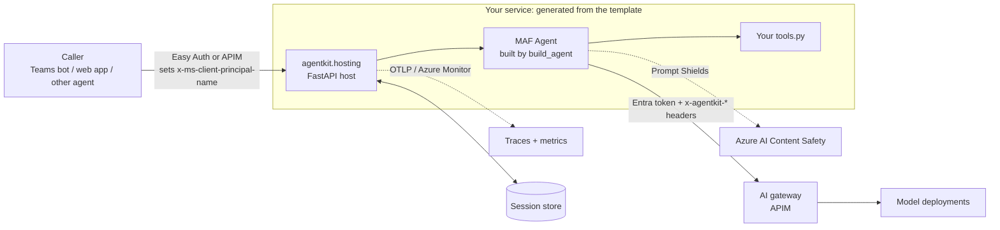
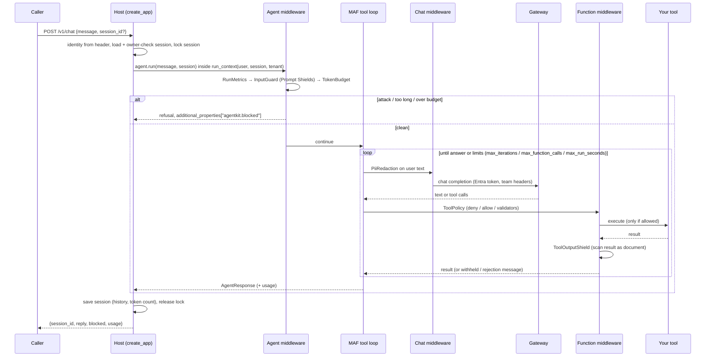

# Architecture: what happens on a request

## The pieces

Your code is the box labelled *Your tools.py*, plus `instructions/system.md` and `evals/`.

## One chat request, step by step

## Middleware order and why

`build_agent` installs the stack in this order, outermost first:

| # | Middleware | MAF layer | Why here |
|---|---|---|---|
| 1 | `AgentRunMetricsMiddleware` | agent | Outermost, so it counts refused runs too (`outcome=blocked`) |
| 2 | `InputGuardMiddleware` | agent | Before any model call: a blocked prompt costs one Prompt Shields call and zero tokens |
| 3 | `SessionTokenBudgetMiddleware` | agent | After the guard, so attacks don't burn budget; before the model, so an exhausted session costs nothing |
| 4 | `PiiRedactionMiddleware` | chat | Applies to what is actually sent to the model, on every loop iteration |
| 5 | `ToolPolicyMiddleware` (if configured) | function | Decides before execution; a rejected tool never runs |
| 6 | `ToolOutputShieldMiddleware` | function | After execution, before the model reads the result |
| 7+ | your `extra_middleware` | any | Innermost |

MAF routes each middleware to its layer by type (`AgentMiddleware`, `ChatMiddleware`, `FunctionMiddleware`), so a single list works.

## Model access

`create_chat_client(settings, agent_name=...)` builds the OpenAI SDK client itself and passes it to MAF's `OpenAIChatCompletionClient`, so auth, headers and transport are controlled in one place.

| `AGENTKIT_GATEWAY_STYLE` | URL shape | Use when |
|---|---|---|
| `azure` (default) | `{gateway}/openai/deployments/{model}/chat/completions?api-version=…` | APIM fronting Azure OpenAI / Foundry deployments |
| `openai_v1` | `{gateway}/openai/v1/chat/completions` | OpenAI-compatible v1 surface |

Every request carries:

| Header | Value | Gateway use |
|---|---|---|
| `Authorization: Bearer …` | Entra token for `AGENTKIT_TOKEN_SCOPE` | Authentication (managed identity in prod) |
| `Ocp-Apim-Subscription-Key` | `AGENTKIT_GATEWAY_SUBSCRIPTION_KEY` (optional) | Per-team APIM product |
| `x-agentkit-team` | `AGENTKIT_TEAM` | `llm-token-limit` counter key, chargeback |
| `x-agentkit-agent` | agent name | Per-agent quotas and dashboards |
| `x-agentkit-service`, `x-agentkit-env` | service name, environment | Routing and reporting |

The Chat Completions API is the default because every APIM GenAI policy (token limits, semantic cache, content safety) supports it.

## Sessions

- A session is MAF's `AgentSession` plus agentkit metadata (owner, pending approvals, approval audit log), stored with `to_dict()` and restored with `from_dict()`.
- **Every request takes a per-session lock, then loads, runs and saves.** Two messages for one conversation never interleave, even across replicas. A request that can't get the lock in 30s gets `409`.
- Records carry an owner. Another user gets `403`, an unknown or expired id gets `404`.
- Stores: in-memory (single replica), **Cosmos DB with managed identity** (what `azd up` configures), or Redis. Details in [sessions-and-approvals.md](sessions-and-approvals.md).

## HTTP API

| Method | Path | Body / response |
|---|---|---|
| `POST` | `/v1/chat` | `{message, session_id?}` → `{session_id, status, reply, blocked, approvals, usage}`; `status` is `completed` or `approval_required`; 409 while an approval is pending |
| `POST` | `/v1/chat/stream` | Same request → SSE: `data: {"delta": "…"}` …, `event: approval_required` if paused, then `event: done` with `{session_id, status, blocked}` |
| `GET` | `/v1/sessions/{id}/approvals` | Pending approvals (owner, or holder of the approver role) |
| `POST` | `/v1/sessions/{id}/approvals` | `{decisions: [{id, approved, comment?}]}` → resumes the run; same response shape as `/v1/chat` |
| `DELETE` | `/v1/sessions/{id}` | 204; 403 if not the owner |
| `GET` | `/healthz` | Liveness |
| `GET` | `/readyz` | Readiness: agent name and version |

Identity comes from `AGENTKIT_USER_HEADER` (default `x-ms-client-principal-name`, set by Container Apps / App Service authentication). Tenant comes from `AGENTKIT_TENANT_HEADER`. In prod, `require_user=true` is enforced, so anonymous calls get `401`.
