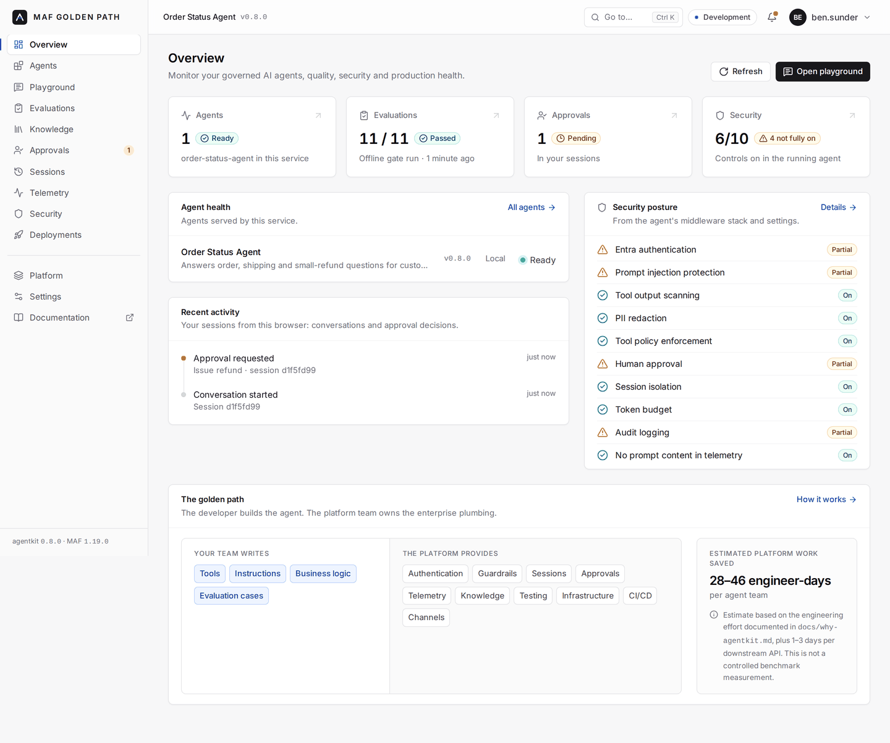
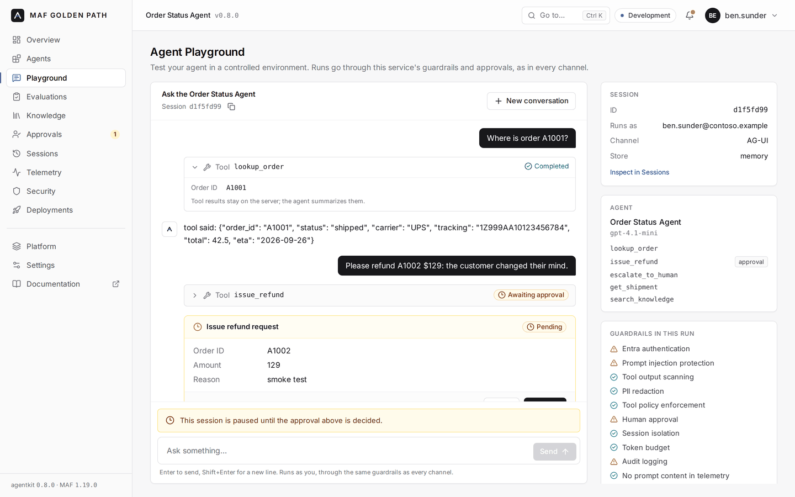

# The console

Every agent service with web chat also serves an operations console at **`/console`**. It covers the agent's overview, a playground, approvals, evaluations, knowledge, sessions, telemetry, security posture, deployments and a guided "create agent" flow. It is for the people who build and run the agent: developers, the platform team, approvers.

```
https://<your-service>/console          # behind the same Entra sign-in as /chat
```





*The sample agent running locally against the kit's fake model gateway, which is why the replies are raw echoes. Everything on screen comes from the running service.*

## Principles

- **Only real data.** Every number and status comes from the running service. A value the service can't know is shown as unavailable, with a pointer to where it lives, never as a sample.
- **Posture from the running agent.** The security card reads the agent's middleware stack and settings at runtime. If PII redaction is off, it says Off, whatever the docs say.
- **Nothing new to deploy.** The console is part of `agentkit-channels`: a prebuilt page (React, no Node needed at runtime) plus a small read-only API. It ships inside the service. There is no separate app, database or server.
- **No conversation content.** The console API never returns messages: what users typed or what the agent answered. It returns the arguments of pending approvals (what an approver has to see) and, to the session's owner only, the audit trail with decision comments. The playground shows your own conversation because you are having it.
- **Plain words for what's checked.** "Ready" means `/readyz` answered: the agent is loaded. It doesn't probe the model gateway, store or search. "Configured" means a setting is present; the console doesn't test the connection. A control that is weaker than it looks is shown as *Partial* with the reason. For example, the requester confirms their own action, Prompt Shields fails open, or the service runs outside Azure where identity headers aren't verified.

## Pages

| Page | Shows | From |
|---|---|---|
| **Overview** | Agent health, quality gate, pending approvals, security posture, recent activity, the golden path | `/readyz`, the console API, your sessions |
| **Agents** | This service's agent: runtime (model, tools, knowledge, channels), tools and which need approval, run limits, governance | The live agent |
| **Playground** | Chat over AG-UI with streaming, tool traces, citations, approvals with confirmation, errors and retry | `/v1/agui` (the same endpoint as `/chat`) |
| **Evaluations** | The quality gate result and every eval case with its checks, status and duration | `evals/cases.yaml` in the image, the gate report |
| **Knowledge** | Search, retrieval and Document Intelligence configuration; how permissions are enforced | The knowledge tool's configuration (no endpoints shown) |
| **Approvals** | Pending requests with Reject / Approve (each confirmed in a dialog), recent decisions with who and when | Your sessions; any session by ID for approvers |
| **Sessions** | Your sessions: status, expiry, pending approvals, audit trail; delete | The session store, owner-checked (an approver sees only what's pending) |
| **Telemetry** | Exporter status, the metrics the agent emits, a link to the operations workbook | Settings; traces stay in Application Insights |
| **Security** | Every control with On / Partial / Off and why | The middleware stack and settings |
| **Deployments** | Version, environment, commit, deploy time, run link, revision, quality gate | Deploy pipeline metadata, Container Apps environment |
| **Platform** | What a team writes vs what the kit provides; the documented effort estimate | Static; the estimate is labeled as one |
| **Create agent** | Pick capabilities, get the exact `copier copy` command and what it generates | The template's real options |
| **Settings** | The service's runtime configuration (read-only) | Settings |

What the console deliberately doesn't do:

- **Fleet view.** Each service has its own console. The kit has no central registry of agents, so the console doesn't pretend to list other services.
- **Charts of production traffic.** The service exports telemetry but doesn't store it, so drawing charts would mean reading your Log Analytics workspace. The Telemetry page links to the platform's operations workbook instead.
- **All sessions.** Sessions are private to their user. The console lists the sessions started from your browser (it remembers their IDs, never their text) and opens any other by ID, with the same ownership rules as the JSON API.
- **Generating agents on the server.** "Create agent" gives you the `copier` command. Generation runs on your machine.

## Turning it on

New services: `enable_console` (default: on when web chat is on). Existing services: `copier update`, or add it by hand:

```python
from agentkit.channels import AgUiChannel, Console, WebChat

result += [AgUiChannel(), WebChat(title="Order Status Agent"), Console(title="Order Status Agent")]
```

For the Evaluations page in deployed environments, copy the eval cases into the image (the template's Dockerfile does):

```dockerfile
COPY evals ./evals
```

`agent-deploy` writes the offline gate report to `evals/gate-report.json` before the image is built, and passes the commit, deploy time and run link. The live gate's report stays on the deploy run page, which the Deployments page links to.

## Who can see it

The console API needs the same sign-in as the rest of the service (Easy Auth). To restrict it to a group of people, create an app role (for example `Console.Read`) on the service's app registration, assign it, and set:

```
AGENTKIT_CONSOLE_ROLE=Console.Read
```

The page itself holds no data, so only the API is restricted. Approvers use the approver role you already have (`AGENTKIT_APPROVER_ROLE`). The console shows them the approval controls and lets them open a request by session ID.

## Settings

| Variable | Default | What it does |
|---|---|---|
| `AGENTKIT_CONSOLE_ROLE` | *(empty)* | App role required for the console API. Empty = any signed-in user of the service |
| `AGENTKIT_CONSOLE_EVAL_CASES` | `evals/cases.yaml` | Eval cases to list |
| `AGENTKIT_CONSOLE_EVAL_REPORT` | `evals/gate-report.json` if present | Quality-gate report (`agentkit-gate --report` or `pytest --agentkit-eval-report`) |
| `AGENTKIT_CONSOLE_WORKBOOK_URL` | set by the Bicep | Link to the platform's operations workbook |
| `AGENTKIT_BUILD_COMMIT`, `AGENTKIT_BUILD_RUN_URL`, `AGENTKIT_BUILD_TIME` | set by `agent-deploy` | Deployments page |

Or in code: `Console(path="/console", api="/v1/console", title=..., role=..., eval_cases=..., eval_report=..., workbook_url=..., docs_url=...)`.

## API

All `GET`, JSON, `Cache-Control: no-store`, same auth as the service:

| Endpoint | Returns |
|---|---|
| `/v1/console/overview` | Service (name, version, environment, hosting, build), caller, agent (model, tools with approval mode, limits), channels, knowledge, security controls, sessions, approvals, telemetry |
| `/v1/console/evals` | Eval cases (id, input, checks, critical) and the gate report, or why either is missing |
| `/v1/console/sessions/{id}` | One session's expiry and pending approvals, plus the audit trail for its owner. The owner, or an approver (pending only) |

Approving and deleting use the existing endpoints (`POST /v1/sessions/{id}/approvals`, `DELETE /v1/sessions/{id}`), so the rules are exactly the JSON API's. The Approvals page sends decisions for exactly the items the person reviewed; if the list changed meanwhile, the service refuses and the page says so.

An approved (or rejected) action always runs to completion on the server, even if the browser disconnects mid-way, so it can't be half-applied and approved twice. The playground's Stop button is unavailable while one runs.

## Security

- Strict CSP: scripts only from the service itself (no inline scripts), `connect-src 'self'`, `frame-ancestors 'none'`. Inline *styles* are allowed for the dialog library's scroll lock, as in `/chat`.
- Agent and tool output is rendered as text, never HTML. Citation links are shown only for `http(s)` URLs.
- The overview never includes endpoints, keys or connection strings.
- The console is `noindex` and sends `Referrer-Policy: no-referrer`.

## Developing the console

The source is in `console/` (Vite, React, TypeScript, Tailwind). The build is committed into `agentkit-channels`, so services never need Node.

```bash
cd console && npm ci
npm run dev          # http://localhost:5173/console/, proxies /v1 to a service on :8000
make console         # type-check, unit tests, build into packages/agentkit-channels (commit the result)
```

Run a service locally for the dev server with a user header: the kit's e2e smoke script shows the environment, or put `AGENTKIT_REQUIRE_USER=false` in `.env`. CI fails if the committed bundle doesn't match the sources. The browser tests in `packages/agentkit-channels/tests/test_console.py` drive the real page against a real server.
