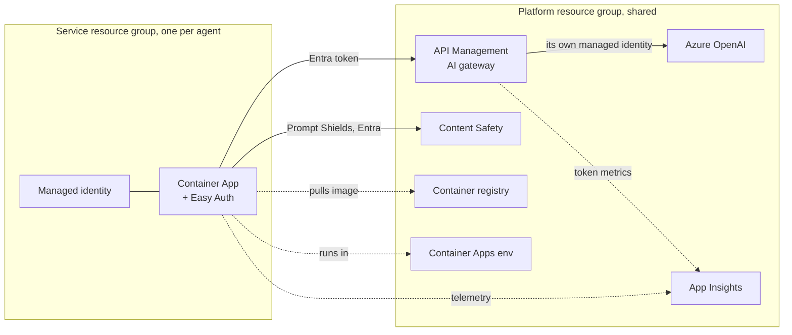

# Deploying: platform once, services with `azd up`

Deployment has two layers:

| Layer | Who | How often | What |
|---|---|---|---|
| **Platform** (`infra/platform/`) | Platform team | Once per environment (dev, prod) | AI gateway (API Management), Azure OpenAI, Content Safety, Container Apps environment, container registry, App Insights, Log Analytics |
| **Service** (`infra/` in every generated repo) | Product team | Every merge | The service's managed identity, least-privilege role grants, Container App with Entra sign-in (Easy Auth) |

A team never creates Azure resources by hand, and a service never holds a model key.



## Part 1: platform (platform team, once per environment)

### What it creates

| Resource | Notes |
|---|---|
| API Management (`BasicV2` by default) | The only path to models. Policy in `infra/platform/policies/ai-gateway.xml` |
| Azure OpenAI + model deployment | `disableLocalAuth: true`, so only the gateway's managed identity can call it. Set `deployOpenAI=false` to front an existing endpoint |
| Content Safety | Prompt Shields for every service. Entra ID only |
| Container Apps environment, container registry (no admin user) | Where services run and where images live |
| Log Analytics + App Insights | App Insights with custom-metric dimensions on, for per-team token metrics |

### What the gateway policy enforces

1. **Entra ID only.** `validate-azure-ad-token` for your tenant, audience `https://cognitiveservices.azure.com`. Service managed identities and developers' `az login` tokens both work; keys don't.
2. **No model credentials in services.** The caller's token is swapped for the gateway's own managed identity (`authentication-managed-identity`).
3. **Quotas that can't be spoofed.** `llm-token-limit` is keyed on the caller's Entra object id: `tokensPerMinutePerCaller` and `tokenQuotaPerCaller` per `tokenQuotaPeriod`. Callers can set the team header to anything, so it isn't used for limits.
4. **Chargeback.** `llm-emit-token-metric` records tokens by Caller, Team, Agent and Environment, from the `x-agentkit-*` headers every service sends.
5. **Resilience.** Retries on 429/5xx, and a circuit breaker on the Azure OpenAI backend.

### Deploy it

```bash
az login
az group create -n rg-agentkit-dev -l eastus2
# edit infra/platform/main.parameters.json: namePrefix, apimPublisherEmail, model, capacity
az deployment group create -g rg-agentkit-dev -n main \
  -f infra/platform/main.bicep -p infra/platform/main.parameters.json
```

API Management takes a while to provision the first time. Then print the values services need:

```bash
python scripts/platform_env.py --resource-group rg-agentkit-dev              # azd env set … lines
python scripts/platform_env.py --resource-group rg-agentkit-dev --format dotenv
```

## Part 2: a service (product team)

The template generates `azure.yaml`, `infra/main.bicep` (and modules), `infra/main.parameters.json`, a `preprovision` check and `.github/workflows/deploy.yml`.

### What it creates

| Resource | Notes |
|---|---|
| Resource group `rg-<azd env name>` | One per service per environment |
| User-assigned managed identity | The service's only credential |
| Role grants on the platform | `AcrPull` on the registry, `Cognitive Services User` on Content Safety. Nothing else |
| Container App | Probes on `/healthz` and `/readyz`, one replica (in-memory sessions; raise `maxReplicas` once a shared session store is configured), App Insights connection string as a secret, all `AGENTKIT_*` settings wired, `AGENTKIT_REQUIRE_USER=true` |
| Easy Auth (when `AGENTKIT_AUTH_CLIENT_ID` is set) | Validates Entra tokens, returns 401 for anonymous calls (except probes), and injects `X-MS-CLIENT-PRINCIPAL-NAME`, the header agentkit reads the caller from |

### One-time: an Entra app registration for the API (Easy Auth)

```bash
APP_ID=$(az ad app create --display-name "orders-agent-api" --sign-in-audience AzureADMyOrg \
  --identifier-uris "api://orders-agent-api" --query appId -o tsv)
az ad sp create --id "$APP_ID"
```

Callers (a web app, Teams bot or another agent) request tokens for this app. Without it, the service deploys but rejects every request. That is the intended secure default, and the preprovision check refuses `prod` without it.

### Deploy from your machine

```bash
azd auth login
azd env new orders-dev
python <kit>/scripts/platform_env.py --resource-group rg-agentkit-dev | sh    # sets AGENTKIT_* platform values
azd env set AGENTKIT_AUTH_CLIENT_ID "$APP_ID"
azd up
```

`azd up` runs the preprovision check, provisions `infra/`, builds the Dockerfile, pushes to the platform registry and rolls out the Container App. The service URL is printed as `SERVICE_API_URI`.

### Deploy from GitHub (OIDC, no secrets)

`.github/workflows/deploy.yml` calls the kit's reusable `agent-deploy.yml`:

1. log in with OIDC (`azure/login` and `azd auth login --federated-credential-provider github`);
2. `azd up`;
3. poll `/healthz` on the new revision;
4. run the **live evals** from `evals/cases.yaml` against the gateway. A behaviour regression fails the deploy.

One-time setup per repo and environment:

```bash
# 1. A deployment identity with a federated credential for this repo's "dev" environment
DEPLOY_APP=$(az ad app create --display-name "deploy-orders-agent" --query appId -o tsv)
az ad sp create --id "$DEPLOY_APP"
az ad app federated-credential create --id "$DEPLOY_APP" --parameters '{
  "name": "github-dev", "issuer": "https://token.actions.githubusercontent.com",
  "subject": "repo:<org>/<repo>:environment:dev", "audiences": ["api://AzureADTokenExchange"] }'

# 2. What it may do
SUB=$(az account show --query id -o tsv)
az role assignment create --assignee "$DEPLOY_APP" --role Contributor --scope "/subscriptions/$SUB"
az role assignment create --assignee "$DEPLOY_APP" --role "Role Based Access Control Administrator" \
  --scope "/subscriptions/$SUB/resourceGroups/rg-agentkit-dev"      # to grant the service identity AcrPull etc.
az role assignment create --assignee "$DEPLOY_APP" --role AcrPush \
  --scope $(az acr show -n <registry> --query id -o tsv)

# 3. GitHub environment variables (not secrets: nothing here is sensitive)
gh variable set AZURE_CLIENT_ID --env dev --body "$DEPLOY_APP"
gh variable set AZURE_TENANT_ID --env dev --body "$(az account show --query tenantId -o tsv)"
gh variable set AZURE_SUBSCRIPTION_ID --env dev --body "$SUB"
gh variable set AZURE_LOCATION --env dev --body eastus2
gh variable set AGENTKIT_AUTH_CLIENT_ID --env dev --body "$APP_ID"
python <kit>/scripts/platform_env.py --resource-group rg-agentkit-dev --format github --repo <org>/<repo> --env dev | sh
```

Scope `Contributor` to a pre-created resource group instead of the subscription if your policy requires it (then set the resource group name in `infra/main.bicep`). Use a `prod` GitHub environment with required reviewers for production.

## What's validated without Azure

`make test-infra` (also in CI) checks everything that can be checked offline:

| Check | Catches |
|---|---|
| `bicep build` + `bicep lint` on the platform, the service and every module | Syntax, unknown properties, type errors, unused params, linter rules (warnings fail the build) |
| Required-parameter check | A Bicep param with no default that `main.parameters.json` doesn't supply, or a stale one |
| Platform↔service contract | A name mismatch between platform outputs, `platform_env.py`, `main.parameters.json` and the preprovision hook |
| `azure.yaml` against azd's JSON schema, plus agentkit rules (`host: containerapp`, `language: python`, Bicep) | Broken azd config |
| `actionlint` on the kit's and the generated repo's workflows | Workflow syntax, bad expressions, wrong action inputs |
| APIM policy XML well-formedness | Broken policy |

What still needs a real subscription: `az deployment ... what-if`, quota for the model deployment in your region, and your organization's Azure Policy.

## Troubleshooting

| Symptom | Likely cause |
|---|---|
| Every call returns 401 | `AGENTKIT_AUTH_CLIENT_ID` isn't set (no Easy Auth, so there's no user header), or the caller's token audience isn't `api://<app>` |
| Service logs `401 Unauthorized: Entra ID token required` from the gateway | `AGENTKIT_TOKEN_SCOPE` changed, or the token is from another tenant |
| `429` with `x-agentkit-remaining-tokens: 0` | The service hit its gateway token limit. Raise `tokensPerMinutePerCaller` on the platform |
| Container stuck pulling the image | `AcrPull` role assignment still propagating (first deploy), or the deploy identity lacked RBAC admin on the platform resource group |
| Prompt Shields errors, every request refused | `Cognitive Services User` on Content Safety is missing. The service fails closed by design |
| `preprovision` fails | Run `platform_env.py` for the platform resource group and pipe it to `sh` |
